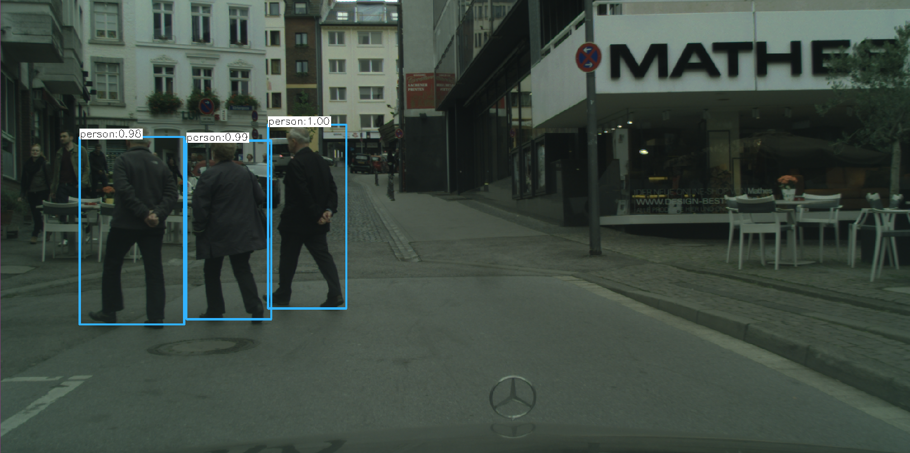
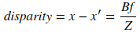
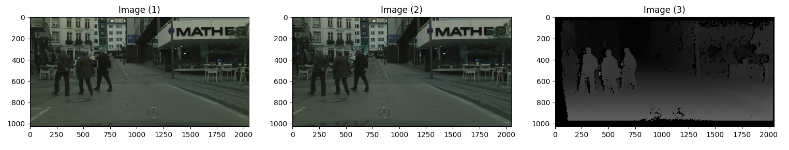
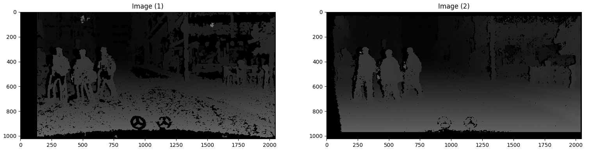

<h1 align="center"> TerpBotics: Human Detector Module
</h1>
ENPM808X-Mid Term Project

[](https://travis-ci.org/sandeep-kota/TerpBotics-Human-Perception-Module)
[](https://coveralls.io/github/sandeep-kota/TerpBotics-Human-Perception-Module?branch=devel)
[](https://opensource.org/licenses/BSD-3-Clause)
---

Human detector module is an open-source perception module for the autonomous vehicle software stack. It is developed by Sandeep Kota Sai Pavan and Satyarth Praveen, the software developers at TerpBotics.

## Team Members

- Sandeep Kota Sai Pavan - [Github Link](https://github.com/sandeep-kota)
- Satyarth Praveen - [Github Link](https://github.com/satyarth934)

## Personnel

 - Sandeep Kota Sai Pavan (Email: skotasai@umd.edu, LinkedIn: [Link](https://www.linkedin.com/in/sandeepkota341997/)): A graduate student of Masters in Engineering - Robotics at University of Maryland, College Park. I'm a robotics enthusiast interested in autonomous vehicles and deep learning.

  - Satyarth Praveen (Email: satyarth@umd.edu, LinkedIn: [Link](https://www.linkedin.com/in/satyarth934/)): I am currently a Robotics graduate student and a Graduate Teaching Assistant with the Department of Mathematics at the University of Maryland College Park. I was previously employed at Hi-Tech Robotic Systemz where I was involved with the perception group of the Unmanned Ground Vehicles (autonomous vehicles). I find my interest in Artificial Intelligence.


## Project Overview

This project is the implementation of a human obstace detector for an autonomous vehicle software stack. 

## Application

Pedestrian detection should be given the maximum priority in an autonomous vehicle software stack as it deals with the lives of the people. Hence, it is critical for the autonomus vehicle to predict the humans with maximum accuracy. Developing a dedicated human detector module helps in achieving improved prediction accuracies for this specific tasks without effect on the other perception modules.

## Project Output Pipeline

The project implements human detection task for an autonomous vehicle software stack to locate multiple humans in a given scene along with the distance of each obstacle detected. The project can be divided into two major tasks.
1) <b> Human Detection Using YOLOv3: </b>
	The first stage of the human detector module involves getting the bounding box prediction values from the human detector module. In our case we are using YOLO model v3 for getting the bounding box predicitons from the left image of the stereo setup. The predictions for human class are stored and the values for the bounding boxes are stored in vectors for the different prediction outputs. A non-max suppression is performed in the prediction outputs to remove the prediciton swith lower confidence. The output of the YOLO object detection module is shown below.
	<p align = "center">
		
	</p>

2) <b> Stereo Image Integration: </b>
	The second stage of the human detector module is the integration of the human detector output with the disparity map generateed between the two images and finding the distance between the object and the camera. 
	<p align = "center">
		
	</p>
	The above diagram contains equivalent triangles. Writing their equivalent equations will yield us following result:
	<p align = "center">
		
	</p>
	x and x′ are the distance between points in image plane corresponding to the scene point 3D and their camera center. B is the distance between two cameras (which we know) and f is the focal length of camera (already known). So in short, the above equation says that the depth of a point in a scene is inversely proportional to the difference in distance of corresponding image points and their camera centers. So with this information, we can derive the depth of all pixels in an image.
	The stero camera images and their disparity map can be viewed below.
	<p align = "center">
		
	</p>
3) <b> Stereo Depth Perception: </b>
	The final stage of the human detection pipeline is the integration of the stereo depth and human detection module. The average depth is calculated over the bounding boxes predicted by the human detection module and the location of the image is calculated w.rt to the camera frame. The output of the human detection module is as shown below.
	<p align = "center">
		 
	</p>
A comparision between the disparity map of the human detector module and the ground truth disparity map is shown below. Image(1) is the disparity map generated by this module whereas the Image(2) is the ground truth disparity map.

<p align = "center">
		
	</p>


## Development using Agile Iterative Process (AIP) and Test-Driven Development

An agile iterative process (AIP) is followed for the development of this project where the product backlog is developed first. Based on the priority of the tasks, the sprint cycles and tasks are decided. A daily meeting at the beggining of the sprint cycle is conducted to decide on the daily tasks for each developer. The project backlog consists of the estimated time of completion which is alloted for each task. The actual time of completion is altered based on the progress of the project and the remaining tasks.

After planning the product backlog, UML flow diagram and UML class diagram for the software are created. A set of unit tests are used to verify the performance on a wide range of exple scenarios. Stub implementations are written with the functions to ensure that the code coverage of the softwrae is maintained.

The link for the product backlog, time log, error log and release log can be found here - [link](https://docs.google.com/spreadsheets/d/1rYvf9irYzHiKXC8cMER0napgb6baDQarvmbKatu3GEE/edit#gid=0) 

The link for the sprint review document can be found here - [link](https://docs.google.com/document/d/1CCiGZ9hGHj-srvOm2HJ4VLTRWsmWSxb5OKR4h5AfE5U/edit?usp=sharing)

## Dependencies

This project was tested for the system with the following dependencies:
- Ubuntu 16.04.6 LTS
- Opencv 3.4.5 (Built from source with contrib)
- GoogleTest

## Build Instructions

For the installation of OpenCV from source, follow the website for instructions - [Link](https://www.learnopencv.com/install-opencv3-on-ubuntu/)
- A point to note while installing opencv is to checkout to branch 3.4.5 in the instructions.
- Anaconda dependency is not required to be installed as the installation of opencv should be a local one and not in an environment. 

After installing the dependencies, follow the procedure to install the Human Detector Module
1. Download the repo into your local system
```
git clone https://github.com/sandeep-kota/TerpBotics-Human-Perception-Module.git
cd TerpBotics-Human-Perception-Module
```
2. Ensure the following lines are present the in the main Cmakelist.txt file and change the SET(OpenCV_DIR) to your `path/to/OpenCV/Dir`. The directory of the openCV directory for our test system was `/usr/local/share/OpenCV/`. 
```find_package( OpenCV REQUIRED)
SET(OpenCV_DIR "/path/to/Opencv/Dir")
```
3. Download the weights and config file for YOLOv3 model from the https://pjreddie.com/darknet/yolo/ website and add it to the '\models' folder. 
3. Make a build directory and run make command in the `\build` directory
```
mkdir build
cd build
cmake ..
make
```
Now the package is ready to use.

## Run Instructions

1. To run the project run the 'shell-app' executable from the build directory
```
cd build
make
./app/shell-app
```

## Run Test Instructions

A set of test images are selected for testing the developed human detection module. The number of detections and the accuracy of the distace in their predictions is taken as the criteria for testing. To run the test cases, run the following command:
```
cd build
./test/cpp-test
```

## Run cppcheck

To detect bugs and perform static code analysis, cppcheck is used. It can be installed with the following command:
```
sudo apt-get install cppcheck
```
To run cppcheck, run the following command in the `/TerpBotics-Human_Perception-Module` folder:
```
cppcheck --enable=all --std=c++11 -I include/ --suppress=missingIncludeSystem $( find . -name *.cpp | grep -vE -e "^./build/" -e "^./vendor/" )
```

## Run cpplint

To check if the Google style guide is followed cpplint is used:
```
sudo apt-get install cpplint
```

To run the cpplint, follow the following commands in the `/TerpBotics-Human_Perception-Module` directory:
```
cpplint $( find . -name \*.hpp -or -name \*.cpp | grep -vE -e "^./build/" -e "^./vendor/" -e "^./data" )
```

## Coverage

The coverage of this program is 90% because:....

## License

This software is released under the [BSD 3-Clause license](./LICENSE). 